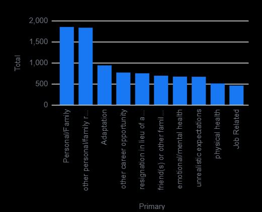
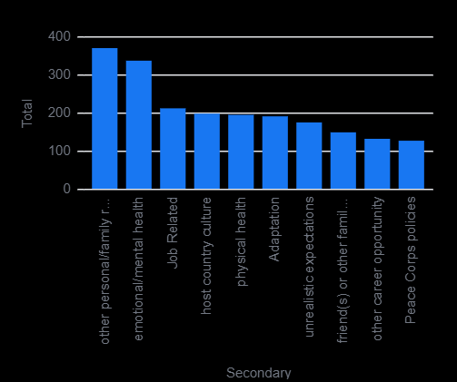
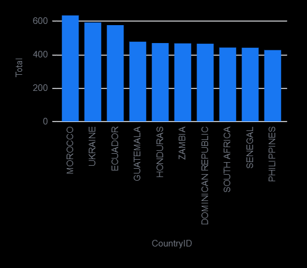
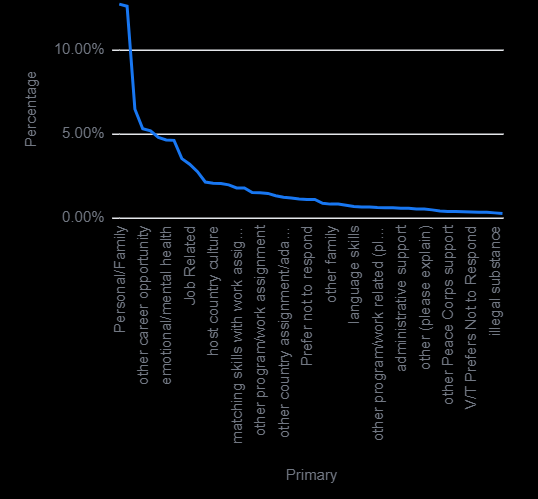
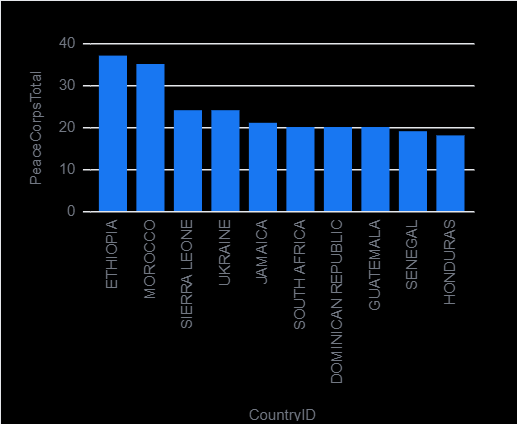

# Peace Corps Data Liberation Project: Griffin Linn

This repository contains data obtained by the [Data Liberation Project](https://www.data-liberation-project.org/) on the resignations of volunteers working for the [Peace Corps](https://www.data-liberation-project.org/datasets/peace-corps-resignations/)

## Summary of Findings

The most important findings can be illustrated through the following visuals:

1. **Most Common Primary Resignation Reasons**  
   

This image illustrates the most common primary reasons for resignation. This helps to identify what reasons should be focused on, and what improvements can be made in those areas.

2. **Most Common Secondary Resignation Reasons**  
   

This image illustrates the most common secondary reasons for resignation. This helps to dive further into what reasons should be focused on, and what improvements can be made.

3. **Countries with the Most Resignations**  
   

This image illustrates which countries have the highest number of resignations, showing where work could be done to improve the Peace Corps programs.

4. **Percentage Breakdown of Primary Resignation Causes**  
   

This image breaks down the primary reasons by percentage, showing a deeper look at what primary reasons for resignation are most common

5. **Peace Corps Issues Related Resignations by Country**  
   

This image illustrates where the most resignations related to issues with Peace Corps policies are. This allows for a more in-depth analysis of how the Peace Corps operates in those countries, and could help to institute proper change.

## Background and Motivation

The primary motivation for this data analyzation is based around seeing what can be improved within the Peace Corps. The Peace Corps does amazing work worldwide, if we are able to take data, use it to identify problems, and properly seek out solutions to those problems, we can create even more effective change worldwide, helping benefit the lives of millions of people. The outreach of data knows no bounds. Being able to take data and create positive change in the world should be a driving force for all research.

## Code

This repository contains one Malloy code file"
-[`Peace_Corps.malloynb`](Peace_Corps.malloynb) is a comprehensive file that both sources all the data used, and performs analysis pieces on the data

## Why Malloy?

[Malloy](https://malloydata.dev) is a unique language for primarily data querying and data visualization, providing an alternative to SQL, pandas, ggplot, and more!

## How see the analysis yourself

You can access the data by either downloading the zip file attached to this GitHub repo, or by pressing the period and running Malloy in the VSCode web browser

## Licensing

This project coincides with files directly provided through a FOIA request done by the Data Liberation Project. All data is in the public domain. The repository's code is available under the [MIT License terms](https://opensource.org/licesnse/mit/).